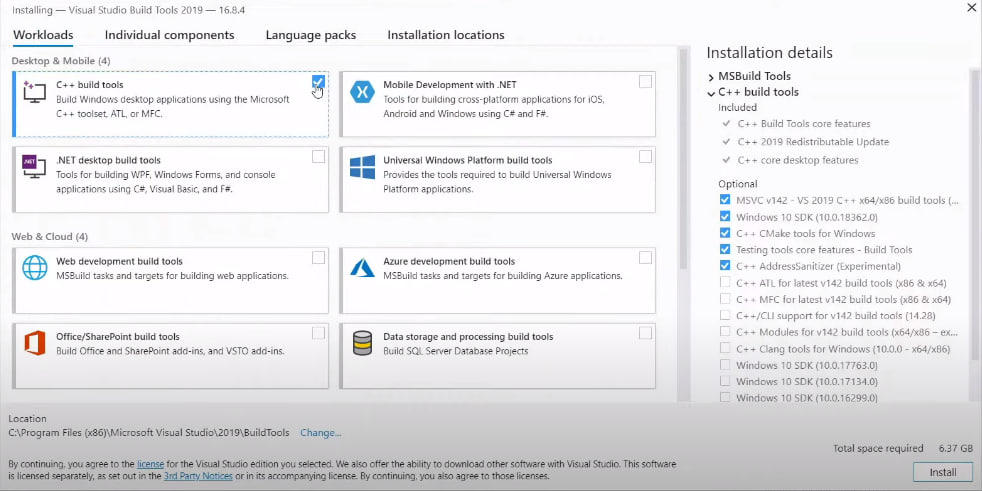

<h1>Во избежание разных ошибок рекомендуется, чтобы название директории с папкой с кодом не содержало кириллицы</h1>
<h1>Для UNIX-систем: </h1>
<h3>
Необходимо выполнить команду: bash install.sh для сборки скомпилированного приложения или make_install_package.sh для сборки установочного пакета
  
</h3>
<h2>
Если необходим установочный пакет
</h2>
<h3>
Если пакетный менеджер системы apt или pacman, то в корневой папке проекта появится файл-установщик BuxarVideoUploader.deb
  
Если пакетный менеджер системы urpmi (можно использовать install_urpmi.sh), то по директории rpmbuild/RPMS появится папка с файлом-установщиком в расширении .rpm
 
</h3>
<h1>Для Windows: </h1>
<h2>
1.Необходимо вручную поставить python версии 3.7 и выше
  
2.Установить Microsoft Visual C++ 14.0 или выше по следующей инструкции:
  
1.https://visualstudio.microsoft.com/visual-cpp-build-tools/
  
2.

 
3.Выполнить сборку проекта с помощью скрипта install_windows.sh с помощью git bash
  
4.С помощью любой утилиты для создания инсталляторов создать файл-установщик. Сам использовал Smart Install Maker. Файл конфигурации оставил (BuxarVideoUploader.smm). Для использования необходимо удалить и заново добавить файлы собранной версии (папка, созданная скриптом, "BuxarVideoUploader/")
  
</h2>
